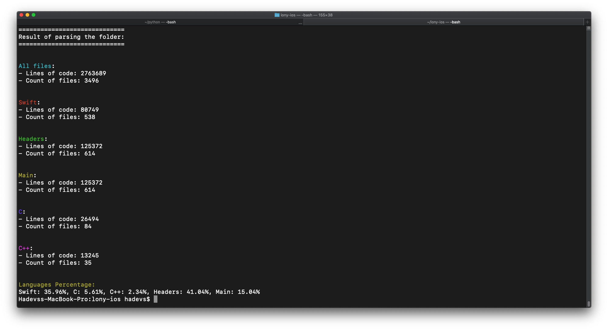

# Xcode Analyze
Python script which analyzes Xcode project to a number of lines and languages percentage.

# Result

# How to use
Just drop `xcode-analyze` file to your project directory and type `./xcode-analyze` in terminal.

# Configuration
You can add `--with-pods` argument to enable parsing your pods directory
